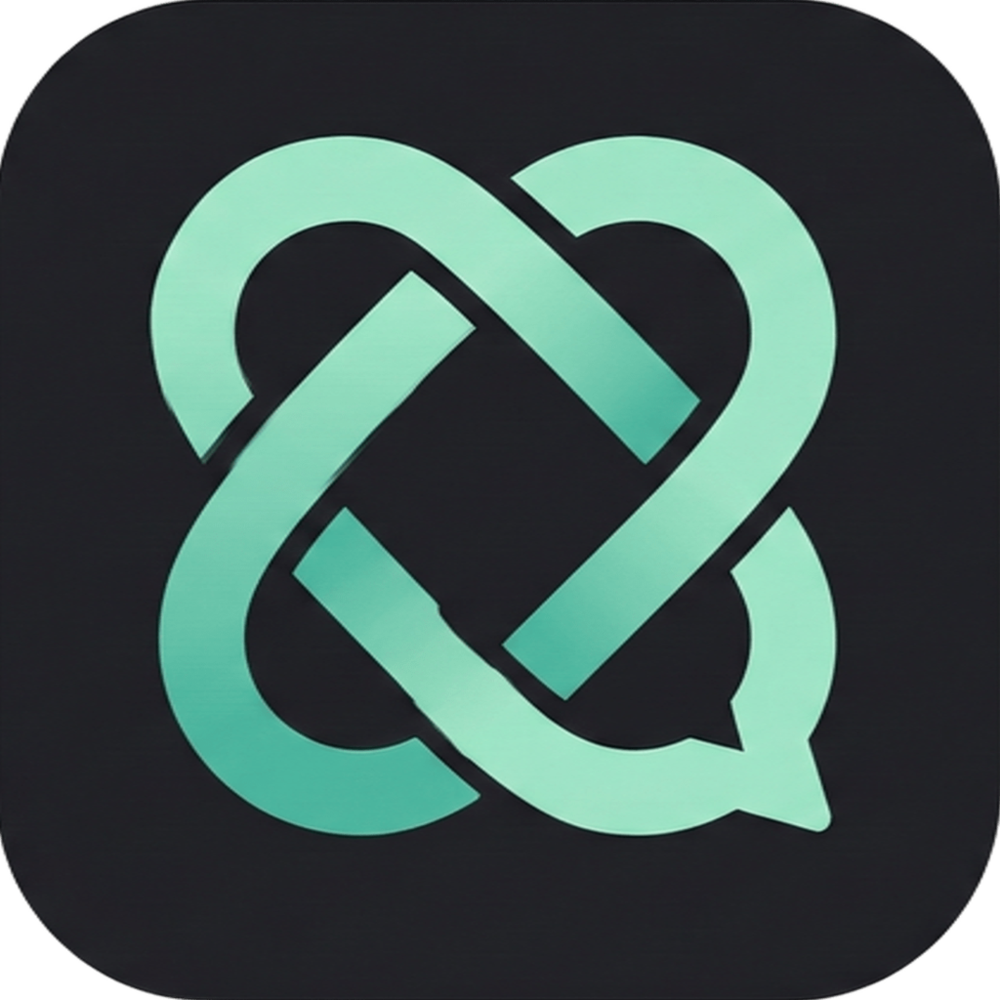
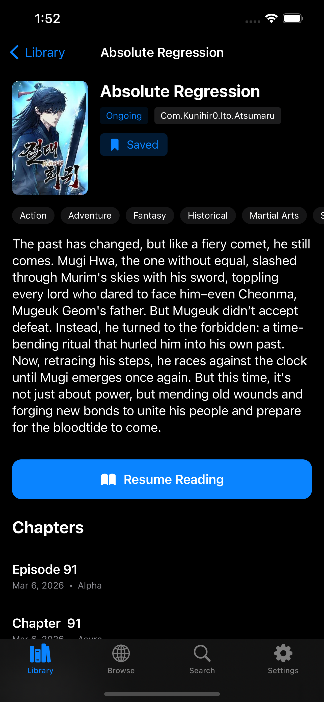
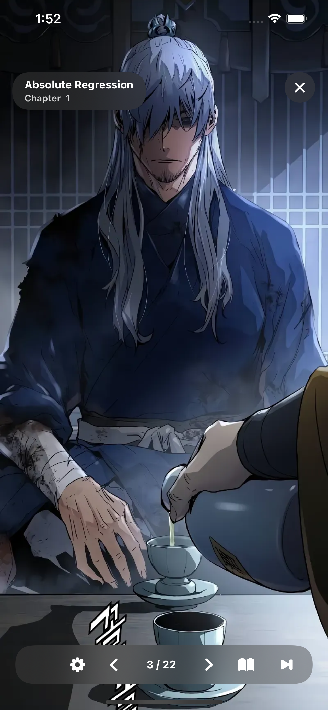

  
  <h1>Ito</h1>
  
<strong>A iOS app for manga and anime.</strong>

---

Ito is a free, ad-free iOS client for reading manga and watching anime. It is free forever and powered by a secure WebAssembly (WASM) plugin architecture.

## Features
* **Manga & Anime:** Read and watch natively in a single app.
* **Zero Ads:** 100% free forever with no advertisements.
* **Progress Tracking:** Sync your library using **AniList** (more coming soon).
* **WASM Plugins:** Dynamic, isolated content sourcing.

## Showcase

  
  &nbsp;&nbsp;
  

## Development
**Requirements:** Xcode 15+, iOS 15.4+, Swift Package Manager.

1. Clone the repository.
2. Open `Ito.xcodeproj` in Xcode.
3. Allow SPM to resolve dependencies.
4. Select your target and build (Cmd + R).

## Contributing
Contributions to the app are welcome via pull requests.