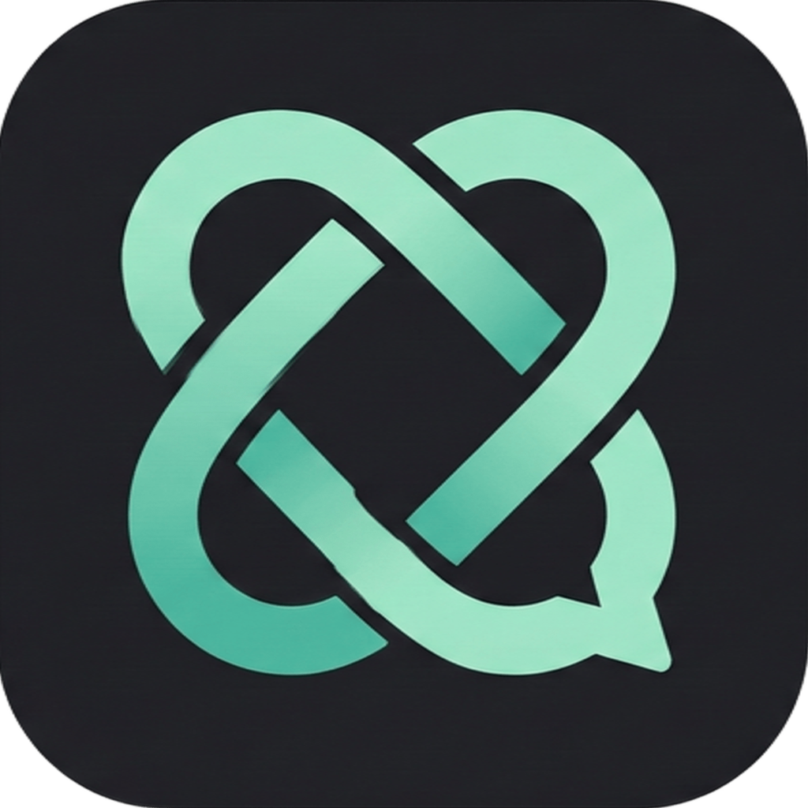
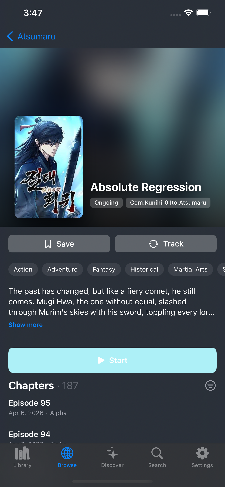
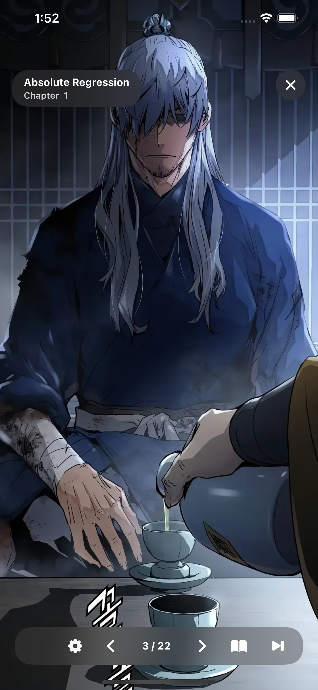
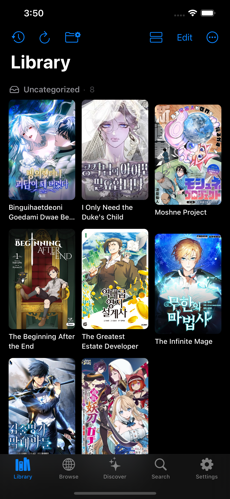

<div align="center">
  

  <h1>Ito</h1>

  <p><strong>Anime, manga, and novels in one native iOS app.</strong></p>
  <p>Discover, read, watch, and track without ads.</p>

  <p>
    
    
    <a href="LICENSE">
      
    </a>
    <a href="https://discord.gg/Es5qTB9BcN">
      
    </a>
  </p>
</div>

---

Ito is a free, open-source client for iPhone and iPad. It combines dedicated readers, native video playback, AniList integration, and an extensible WebAssembly plugin system in a single app.

## Features

* **Anime, manga, and novels** — Keep different media types together in one library.
* **Native reading** — Dedicated manga and novel readers designed for iOS.
* **Native video playback** — Select available video quality, audio tracks, and subtitles.
* **AniList discovery** — Browse, search, and filter titles using AniList.
* **Progress tracking** — Connect AniList to track what you read and watch.
* **WASM plugins** — Install `.ito` plugins from user-added repositories. Downloaded packages are SHA-256 verified before installation.
* **Backup and migration** — Export native `.itobackup` files or import libraries from Aidoku and Paperback.
* **On-device storage** — Library data and history are stored locally, with tracker credentials protected by Keychain.
* **No advertisements** — Ito is free and ad-free.

## Showcase

<p align="center">
  
  &nbsp;
  
  &nbsp;
  
  &nbsp;
  
</p>

## Supported imports

| Source         | Formats         |
| -------------- | --------------- |
| Ito            | `.itobackup`    |
| Aidoku         | `.aib`, `.json` |
| Paperback v0.8 | `.pas4`, `.zip` |

Backups can replace the existing library or be merged with it. Imported sources are matched against installed Ito plugins when possible.

## Build from source

### Requirements

* Xcode 26.2 or later
* Swift 6.2
* iOS or iPadOS 15.4 deployment target
* Swift Package Manager

Ito uses `ito-runner` as a local Swift package. Both repositories must be placed in the same parent directory:

```text
ito-dev/
├── Ito/
└── ito-runner/
```

Clone and open the project:

```sh
mkdir ito-dev
cd ito-dev

git clone https://github.com/itoapp/ito-runner.git
git clone https://github.com/itoapp/Ito.git

open Ito/Ito.xcodeproj
```

Allow Swift Package Manager to resolve the remaining dependencies, select a signing team and target device, then build with `⌘R`.

## Contributing

Pull requests are welcome. Keep changes focused, follow the existing SwiftLint configuration, and include tests for behavioral changes where practical.

## License

Ito is licensed under the [Mozilla Public License 2.0](LICENSE).

## Content and legal notice

> [!WARNING]
> Ito is a client and does not include or host media sources. Users are responsible for the repositories and plugins they install and for complying with applicable laws, licenses, and service terms. The maintainers do not endorse copyright infringement or other unlawful use.
